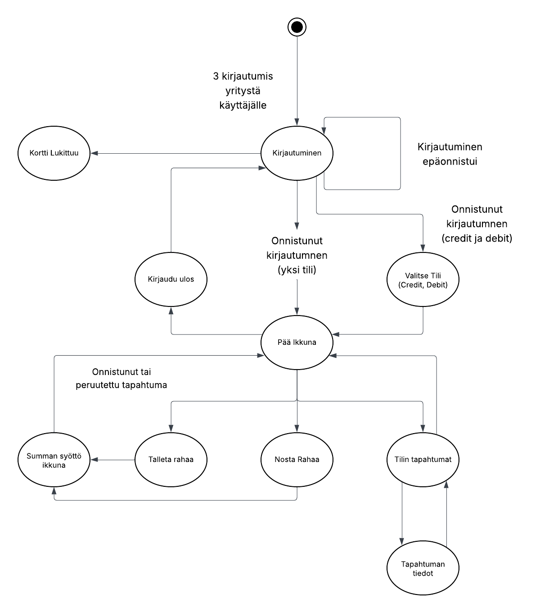
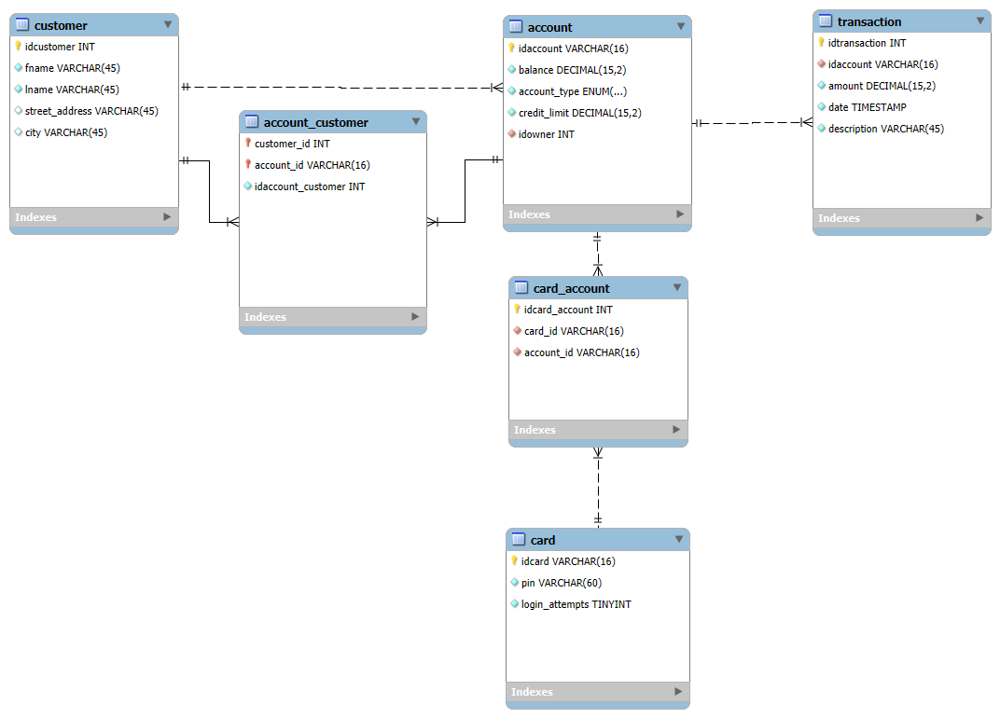

# Group 11 ATM project

This project is a working ATM machine system, made to resemble mostly how real-life ATM machines work. It uses a QT C++ Application as the frontend, express.js as the backend and MySQL server as the database. 

# Features
- Logging in using a card's number and pin code
- Viewing an account's balance
- Withdrawing or depositing money
- Viewing transaction history
- Either debit or credit only cards or combination cards (both debit and credit on one card)
- Card locking when too many incorrect login attempts are made
- Automatically logging out after 30 seconds of inactivity
- Swagger documentation for all backend endpoints

# Frontend application

Development not started yet

</img>

# Database design

</img>

# Usage

The backend can be run on a server using Nginx as a reverse proxy or locally on your own machine.

1. Clone repository.
2. Run "npm install" in "\group_11\backend\".
3. Install MySQL server of choice and start it.
4. Create a database called "bank_db" and a user to access it.
4. Create a ".env" file in "\group_11\backend\". Follow instructions in "\group_11\backend\env_example" to see which fields it needs to contain.
5. Synchronize database model "\group_11\backend\database\bank_er.mwb" using MySQL Workbench to your MySQL server.
6. Run "nodemon start" in "\group_11\backend\".
7. Open the QT C++ Application to use the ATM machine.