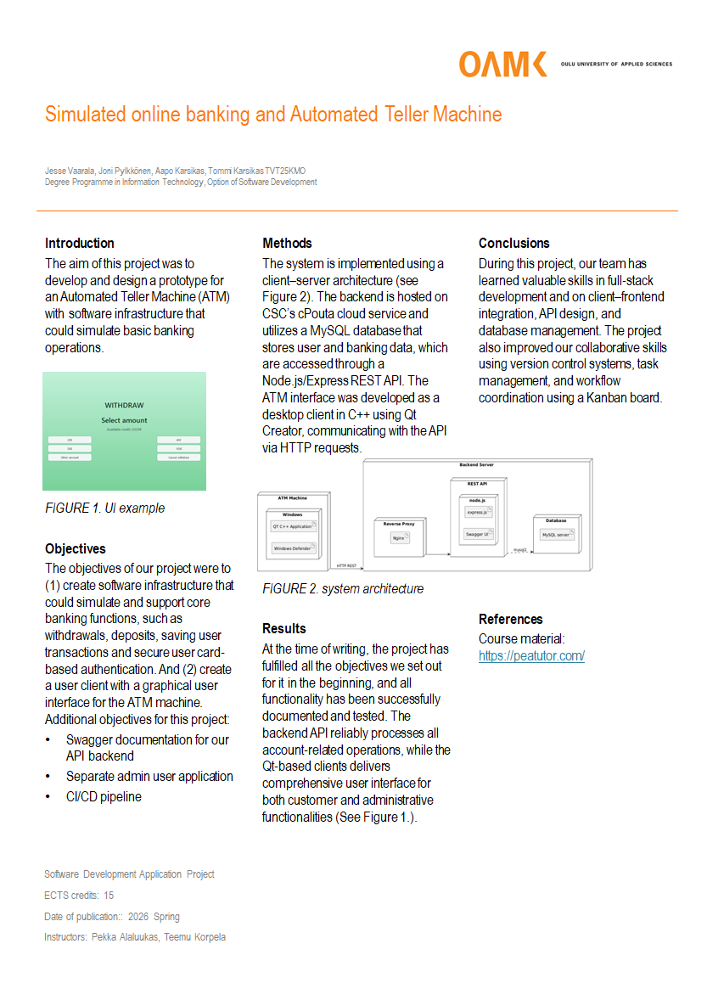
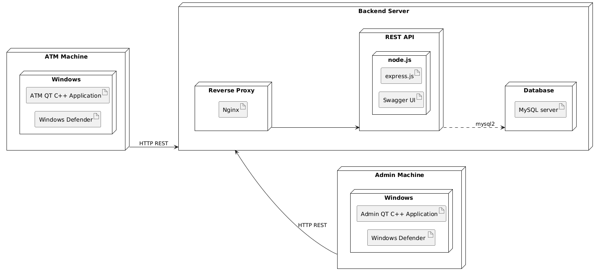
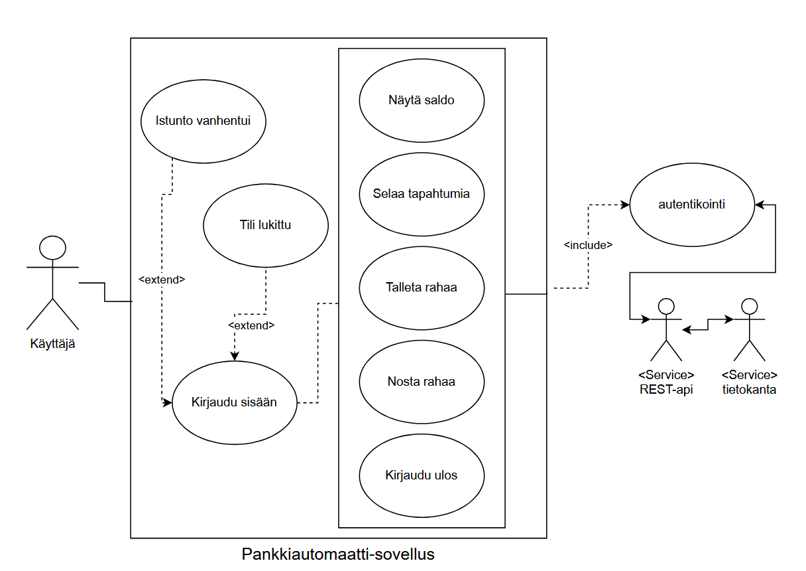

# Group 11 ATM project

This project is a working ATM machine system, made to resemble mostly how real-life ATM machines work. It uses a QT C++ Application as the frontend, express.js as the backend and MySQL server as the database. The backend is ran on a cloud virtual machine using CSC's cPouta service.
 
An admin application is also included which can be used to manage the system, such as creating new customers, accounts and cards.

</img>

# Features
- Logging in using a card's number and pin code
- Viewing an account's balance
- Withdrawing or depositing money
- Viewing transaction history
- Either debit or credit only cards or combination cards (both debit and credit on one card)
- Card locking when too many incorrect login attempts are made
- Automatically logging out after 30 seconds of inactivity
- Card ID and PIN fields automatically cleared after 10 seconds of inactivity
- Swagger documentation for all backend endpoints
- Admin application
- Github action for deploying backend to a remote server
- Github action for building and releasing the QT application
- Backend on a remote server (VPS), backend deploy script and Nginx configuration are included in "group_11\linux".
- Every database table has an endpoint for all CRUD actions

# System architecture and use case diagrams

System architecture diagram. Reverse proxy is not necessary if the backend and frontend are being run on the same machine.

</img>

Use case diagram:

</img>

# Frontend Application
State diagram of the frontend app

</img>

# Database Design

</img>

# Usage

Install the newest release from https://github.com/25kmo-project/group_11/releases and run it. 
 
The backend is being run on a remote server that the frontend application will connect to.

# Development

Any development should be done on a separate branch.

Initializing the repository for development:
1. Clone repository.
2. Run "npm install" in "\group_11\backend\".
3. Install MySQL server of choice and start it.
4. Create a database called "bank_db" and a user to access it.
4. Create a ".env" file in "\group_11\backend\". Follow instructions in "\group_11\backend\env_example" to see which fields it needs to contain.
5. Synchronize database model "\group_11\backend\database\bank_er.mwb" using MySQL Workbench to your MySQL server.
6. Run "nodemon start" in "\group_11\backend\".
7. Open the bank-automat project in QT Creator.
8. Replace the base URL in "group_11\bank-automat\environment.cpp" with "http://localhost:3001/".

Nodemon will automatically reload the backend when any changes are made with the exception of Swagger documentation files.

When a pull request is approved and pushed to main:
1. deploy-backend.yml will deploy backend changes to the remote server if any were made.
2. build-frontend.yml will build and release a new version of the frontend QT application to the Releases page in Github. 